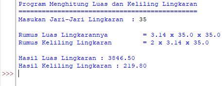

# Menghitung-Luas-dan-Keliling-Lingkaran


## Rumus Luas dan Keliling Lingkaran

```bash
Luas     = π × r²
Keliling = 2 x π × r
```


- Nilai phi yang di gunakan adalah 3.14
- r merupakan jari-jari lingkaran

Phi merupakan nilai konstanta dalam matematika yang merupakan perbandingan keliling lingkaran dengan diameternya. phi juga memiliki nilai 3,14 atau 22/7. namun program ini saya buat menggunakan nilai 3,14. Sementara jari-jari merupakan jarak antara titik pusat dengan tepi lingkaran. Sebetulnya ada rumus lain untuk menghitung keliling lingkaran yaitu dengan menggunakan diameter, tapi pada kasus ini kita cukup menggunakan jari jari lingkaran saja.

### Flowchart Menghitung Luas dan Keliling Lingkaran

 


Selain itu kita menggunakan simbol arus (Flow Direction Symbol) untuk menghubungkan antar simbol satu dengan simbol lainnya, simbol arus di gambarkan seperti anak panah sebagai petunjuk arah arus dari proses yang berjalan.

#### Penggunaan Simbol Flowchart
- Proses mulai dan selesai kita menggunakan simbol terminal sebagai tanda awal (start) dan akhir (End) pada proses tersebut.
- Untuk inisialisasi variabel kita gunakan simbol proses, karena menunjukan kegiatan yang dilakukan oleh komputer.
- Untuk memasukan nilai jari-jari (r) kita menggunakan simbol input karena nilai tersebut akan dimasukan oleh user.
- Pendefinisian rumus luas lingkaran menggunakan simbol proses.
- Terakhir untuk menampilkan hasil perhitungan luas lingkaran kita menggunakan simbol output.


### Program Menghitung Luas dan Keliling Lingkaran

```bash
print("Program Menghitung Luas dan Keliling Lingkaran")
print("==============================================")
r = float(input("Masukan Jari-Jari Lingkaran  : "))

phi = 3.14
luas = phi*r*r
kel = 2*phi*r

print ()
print ("Rumus Luas Lingkarannya \t=",phi,"x",r,"x",r,)
print ("Rumus Keliling Lingkaran \t=",2,"x",phi,"x",r,)
print ()
print ("Hasil Luas Lingkaran :",format(luas,'.2f'))
print ("Hasil Keliling Lingkaran :",format(kel,'.2f'))
```

### Penjelasan

Selanjutnya kita memerlukan nilai jari-jari (r) yang nantinya akan di masukan oleh pengguna pada layar console. Kita menggunakan fungsi input() yang nilainya di konversi ke tipe data float (bilangan riil). Ingat bahwa fungsi input() akan menganggap semua nilai inputan bertipe string, sehingga kita perlu melakukan konversi ke tipe yang diinginkan.

Ketika kita sudah mendapat nilai phi dan jari-jari selanjutnya kita bisa menghitung luas dan keliling sesuai dengan rumus-nya.

Selanjutnya kita tampilkan hasilnya dengan fungsi print(). sintak \t merupakan karakter espace yang berfungsi untuk membuat tab. dalam kasus ini agar sejajar karakter sama dengan (=) nya.

Jika dilihat hasil luas dan keliling lingkaran mempunyai angka pecahan yang cukup banyak, untuk mengambil 2 angka pecahan saja kita pakai fungsi format() seperti gambar di atas.

### Output



### TERIMA KASIH